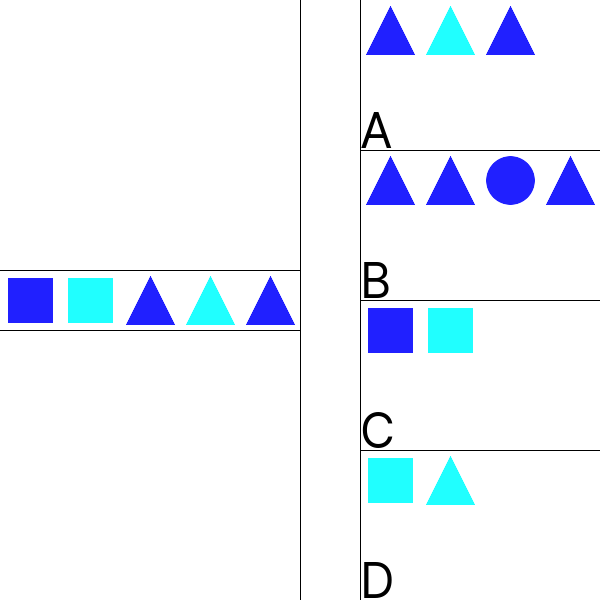

# 2D Images. Colored types.
## Image



## JSON
**One number** - number og length of right variant.

```1```

## Path&Link
<a href = "https://innovations.kh.ua/images/2dimages/coloredtypesjson/colored_types_json.php?t=1" target = "_blank">```https://innovations.kh.ua/images/2dimages/coloredtypesjson/colored_types_json.php?t=1```  </a>  


