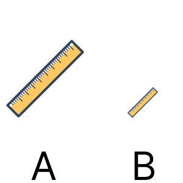

# 2d images. Compare of Objects
## Image



## JSON
Array with 2 elements with type of elements in current position.  
* 1st element - type (0 - pencil, 1 - ruler)  
* 2nd element - quenue (0 - first is short, 1 - first is long).  
  
```[2,1]```

## Path&Link
<a href = "https://innovations.kh.ua/images/2dimages/compareofobjects/compare_of_objects.php?t=[2,1]" target = "_blank">```https://innovations.kh.ua/images/2dimages/compareofobjects/compare_of_objects.php?t=[2,1]```  </a>  


https://innovations.kh.ua/images/2dimages/compareofobjects/compare_of_objects.php?t=[2,1]