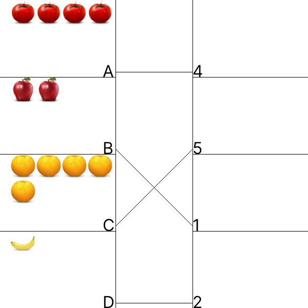

# 2D Images. Correspondent of Objects.
## Image



## JSON
4 Arrays for 4 elements in each one. 1st - number of elements in each block. 2nd - type of elements in every blocks. 3rd - numbers in 2-nd blocks. 4td - connections fron every clock in 1 column:  

**Types of elememts:**  
* 0 - apple     
* 1 - banana     
* 2 - orange     
* 3 - tomato     

```[[4,2,5,1],[3,0,2,1],[4,5,1,2],[0,2,1,3]]```

## Path&Link
<a href = "https://innovations.kh.ua/images/2dimages/correspondentofobjects/correspondent_of_objects.php?t=[[4,2,5,1],[3,0,2,1],[4,5,1,2],[0,2,1,3]]" target = "_blank">```https://innovations.kh.ua/images/2dimages/correspondentofobjects/correspondent_of_objects.php?t=[[4,2,5,1],[3,0,2,1],[4,5,1,2],[0,2,1,3]]```  </a>  
