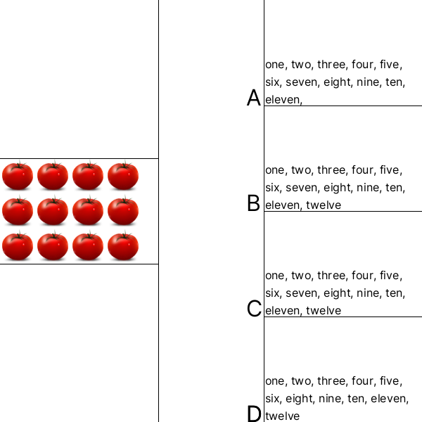

# 2D Images. Count of Objects.
## Image



## JSON
4 Arrays for 4 elements in each one. 1st - number of elements in main block. 2nd - type of elements in every blocks. 3rd - number of right answer:  

**Types of elememts:**  
* 0 - apple     
* 1 - banana     
* 2 - orange     
* 3 - tomato     

```[12,3,2]```

## Path&Link
<a href = "https://innovations.kh.ua/images/2dimages/countofobjects/count_of_objects.php?t=[12,3,2]" target = "_blank">```https://innovations.kh.ua/images/2dimages/countofobjects/count_of_objects.php?t=[12,3,2]```  </a>  
