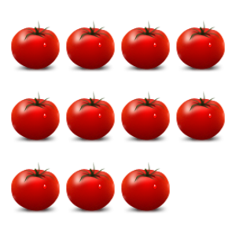

# 2D Images. Group of Objects.
## Image



## JSON
Array for 2 elements number. 1st element - number of elements. 2nd - type of elements:

* 0 - apple     
* 1 - banana     
* 2 - orange     
* 3 - tomato     

```[11,3]```

## Path&Link
<a href = "https://innovations.kh.ua/images/2dimages/groupofobjects/group_of_objects.php?t=[11,3]" target = "_blank">```https://innovations.kh.ua/images/2dimages/groupofobjects/group_of_objects.php?t=[11,3]```  </a>  
