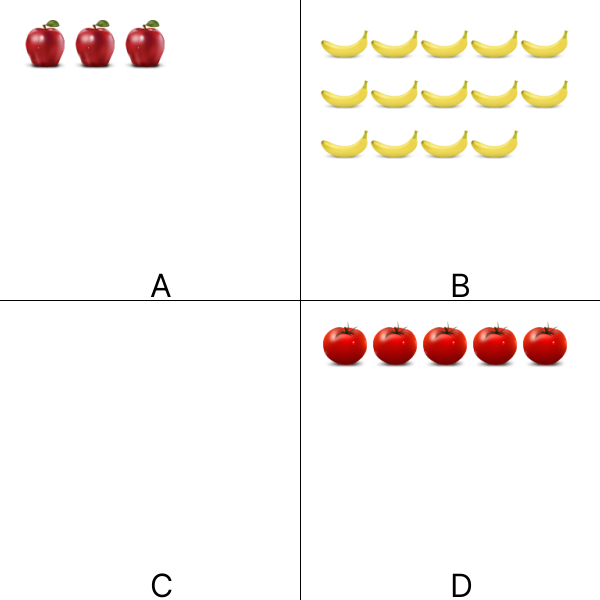

# 2D Images. Number of Objects.
## Image



## JSON
Array for 4 elements of required numbers.

```[3,14,0,5]```

## Path
```https://innovations.kh.ua/images/2dimages/numberofobjects/number_of_objects.php?t=[3,14,0,5]```  
  
## Link
<a href = "https://innovations.kh.ua/images/2dimages/numberofobjects/number_of_objects.php?t=[3,14,0,5]" target = "_blank">Link</a>