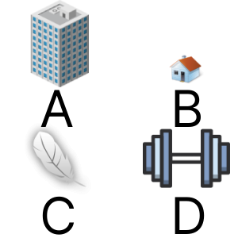

# 2d images. Options of Objects
## Image



## JSON
Array with 4 relements with type of elements in current position.
* big
* small
* light
* heavy

```["big","small","light","heavy"]```

## Path&Link
<a href = "https://innovations.kh.ua/images/2dimages/optionsofobjects/options_of_objects.php?t=[%22big%22,%22small%22,%22light%22,%22heavy%22]" target = "_blank">```https://innovations.kh.ua/images/2dimages/optionsofobjects/options_of_objects.php?t=[%22big%22,%22small%22,%22light%22,%22heavy%22]```  </a>  


https://innovations.kh.ua/images/2dimages/optionsofobjects/options_of_objects.php?t=[%22big%22,%22small%22,%22light%22,%22heavy%22]
