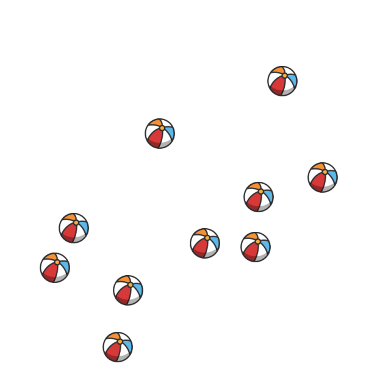

# 2D Images. Scattered Objects.
## Image



## JSON
Array with 1 element - number of elements 

```[10]```

## Path&Link
<a href = "https://innovations.kh.ua/images/2dimages/scatteredobjects/scattered_objects.php?t=[10]" target = "_blank">```https://innovations.kh.ua/images/2dimages/scatteredobjects/scattered_objects.php?t=[10]```  </a>  
