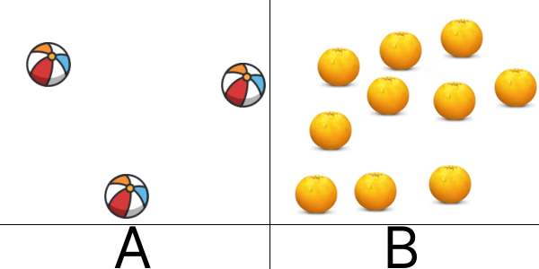

# 2D Images. Sets of objects.
## Image



## JSON
Array with 2 elements - number of elements. st element - number of elements in block A. 2nd elements - number of elements in block B.

```[3,10]```

## Path&Link
<a href = "https://innovations.kh.ua/images/2dimages/setsofobjects/sets_of_objects.php?t=[3,10]" target = "_blank">```https://innovations.kh.ua/images/2dimages/setsofobjects/sets_of_objects.php?t=[3,10]```  </a>  


