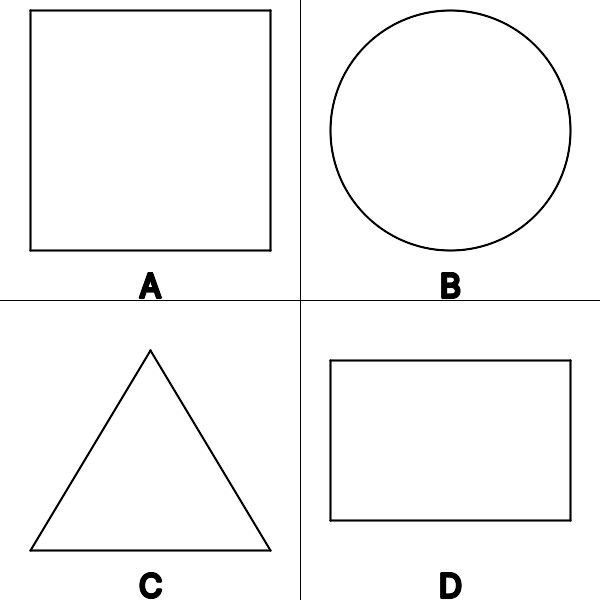

# 2D Shapes. Types
## Image
  

## JSON
Array of types:
* s - **Square**
* c - **Circle**
* t - **Triangle**
* r - **Rectangle**
* p - **Parallelogram**
* h - **Hexagon**
* rh - **Rhombus**

```["s","c","t","r"]```

## Path
``` https://innovations.kh.ua/images/types_json.php?t=[%22s%22,%22c%22,%22t%22,%22r%22] ```

## Link
<a href = "https://innovations.kh.ua/images/types_json.php?t=[%22s%22,%22c%22,%22t%22,%22r%22]" target = "_blank">Link</a>
